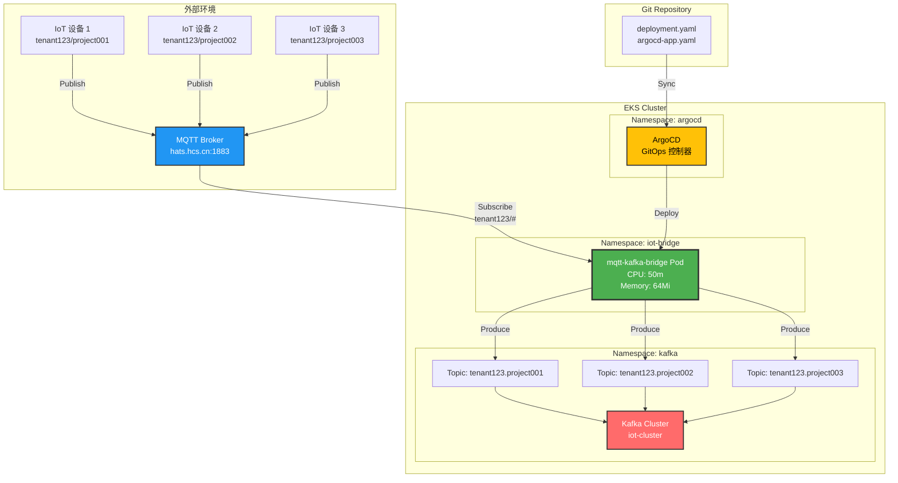
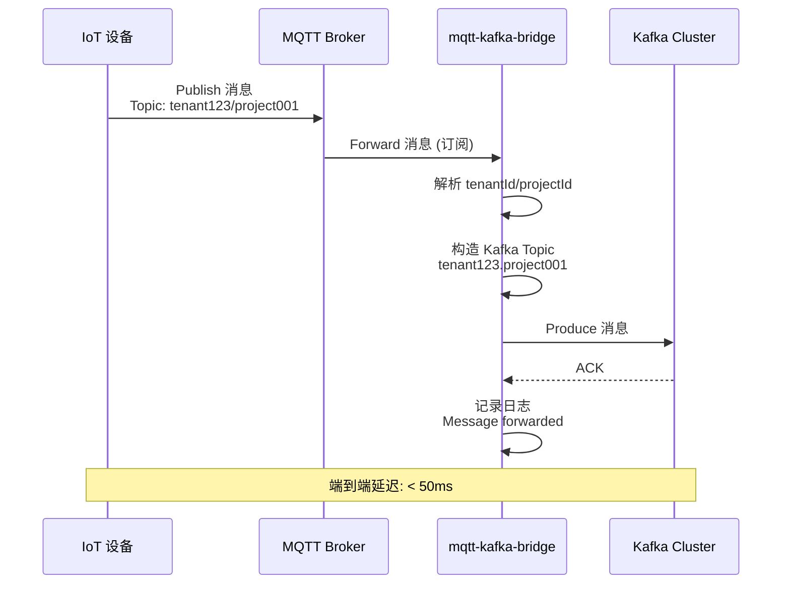
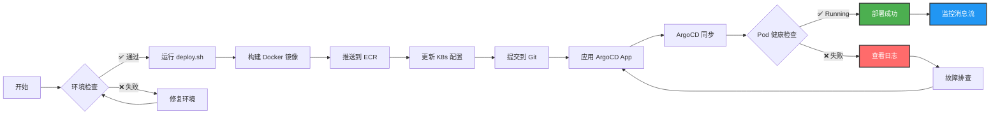
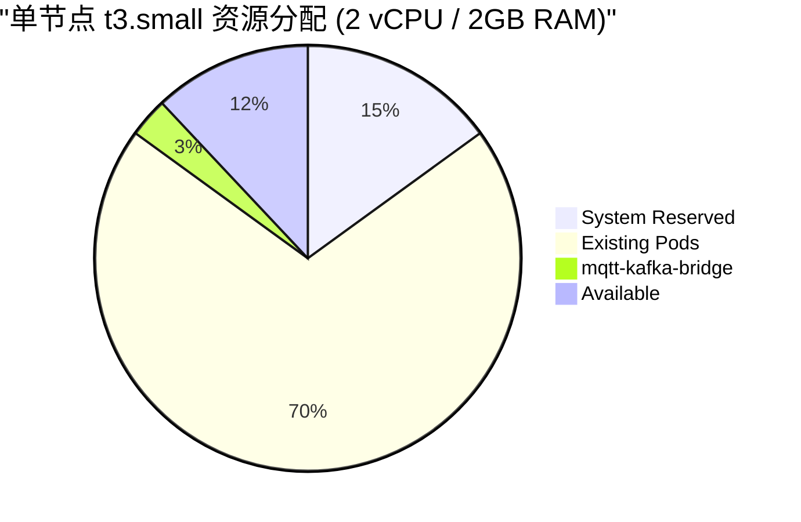
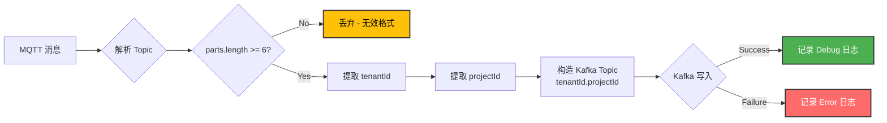
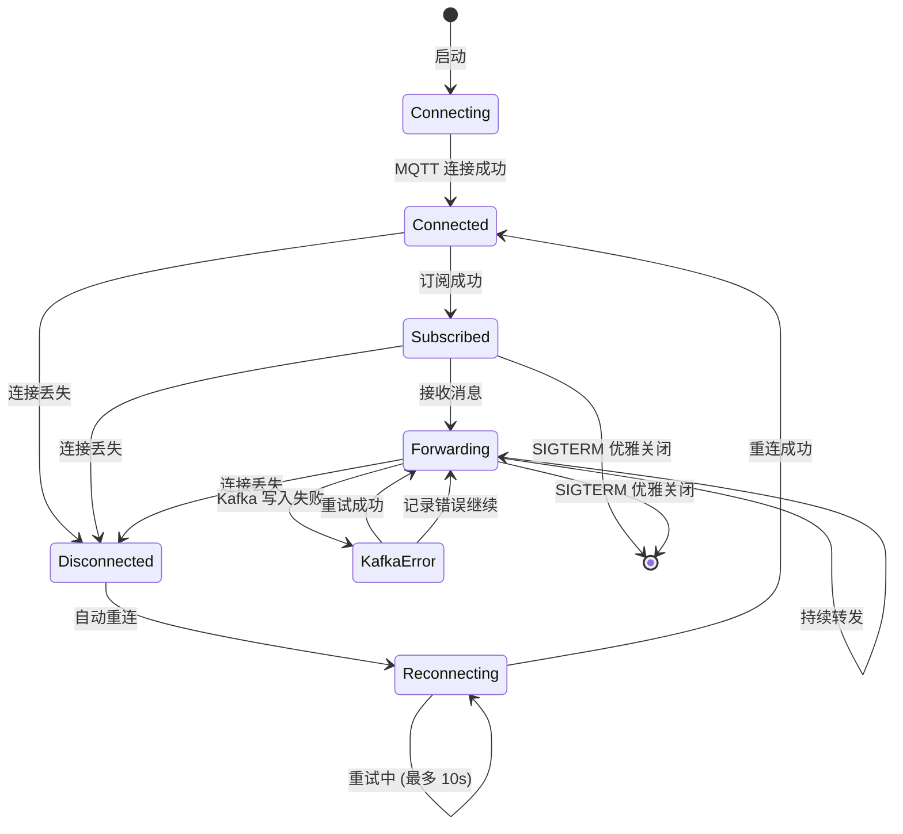

## 消息流程详解

### 1. 发布阶段 (IoT 设备 → MQTT Broker)
```
IoT Device → MQTT Broker
Topic: mtic/msg/client/realtime/tenant123/project001
Payload: {"deviceId": "sensor-001", "temp": 25.3, ...}
```

### 2. 订阅阶段 (Bridge → MQTT Broker)
```
Bridge 订阅: mtic/msg/client/realtime/tenant123/#
↓
接收所有 tenant123 下的消息:
  - tenant123/project001
  - tenant123/project002
  - tenant123/project003
```

### 3. 转换阶段 (Bridge 内部处理)
```go
// 解析 MQTT Topic
input:  "mtic/msg/client/realtime/tenant123/project001"
output: {
    tenantId: "tenant123",
    projectId: "project001",
    kafkaTopic: "tenant123.project001"
}
```

### 4. 写入阶段 (Bridge → Kafka)
```
Kafka Message {
    Topic: "tenant123.project001"
    Key: "project001"
    Value: {"deviceId": "sensor-001", "temp": 25.3, ...}
}
```

### 5. GitOps 部署流程
```
开发者 Push → Git Repository
    ↓
ArgoCD 检测变更
    ↓
自动同步到集群
    ↓
Bridge Pod 更新
```

## 时序图



## 部署流程图



## 资源占用对比



## 消息路由逻辑



## 容错机制


